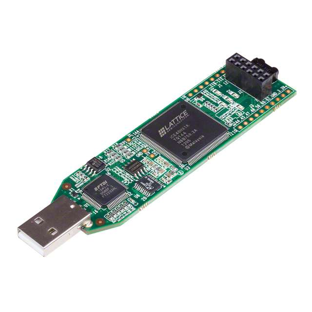

# Lattice FPGA: iCE40 HX1K

Tutorials based on the FPGA (Field Programmable Gate Array) YouTube series from DigiKey by Shawn Hymel.

 
<small>
    The Lattice iCEstick Evaluation Kit. [image source](https://www.digikey.com/en/products/detail/lattice-semiconductor-corporation/ICE40HX1K-STICK-EVN/4289604).
</small>

- [DigiKey: Introduction to FPGA](https://www.youtube.com/playlist?list=PLEBQazB0HUyT1WmMONxRZn9NmQ_9CIKhb) Playlist on YouTube.
- [DigiKey: Written Transcripts](https://www.digikey.com/en/maker/projects/introduction-to-fpga-part-1-what-is-an-fpga/3ee5f6c8fa594161a655a9f960060893) to accompany the YouTube Playlist.
- [GitHub: Intro to FPGA](https://github.com/ShawnHymel/introduction-to-fpga) Repository by Shawn Hymel to accompany the video.
- [APIO Documentation](https://apiodoc.readthedocs.io/en/stable/) for FPGA Programming.
- [APIO: GitHub Repo](https://github.com/FPGAwars/apio) for the open source tool.
- [DigiKey: Buy a Lattice iCEstick](https://www.digikey.com/en/products/detail/lattice-semiconductor-corporation/ICE40HX1K-STICK-EVN/4289604).

## Status:

